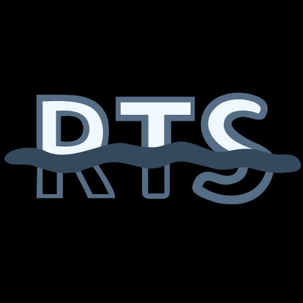

<h1>Real-Time Script</h1>

Reactive Programming Language of Free Data Structures

<h3 align="center">Introduction</h3>

RTS uses its own reactive programming paradigm of free data structures. This differs from classical approaches such as procedural, object-oriented, functional programming and others. The main feature is that the programmer is given the freedom to write any data structures, their reactive interaction and trouble-free operation. RTS negates the concept of errors, there is only unexpected behavior. Thus, the code directly depends on the goals, imagination and skill of the programmer.

The language uses the Latin alphabet as a technical one and any other language as explanatory-accompanying, more understandable to the developer.
> This is associated with the widespread use of the Latin alphabet in exact sciences and global distribution. In one English word, there can be many meanings, and the generalizing meaning is clearly visible. However, this does not exclude porting the syntax to other world languages. The original form should be taken as an international standard.

It is expected to write programs of any complexity and completely free structures, running them in interpretation mode. At its core, the programmer has to choose between writing everything from scratch, even some basic functions, or importing ready-made solutions from a package manager.

The goals and objectives of RTS:
* Rapid Deployment: Simplified setup and project launch;
* Global Repository: Centralized management of dependencies and packages;
* Interpretation: Ability to execute code on the fly, speeding up development;
* Multitasking: Running multiple projects simultaneously;
* Machine Code: Direct execution on the processor for maximum performance;
* Flexible Data Management: Unrestricted structures allow working with data without strict limitations;
* Reactivity: Automatic processing of changes.

Thus, RTS is ideal for tasks that require rapid deployment, support for running multiple projects simultaneously, high performance, and reliability. It automates processes in systems with dynamic changes, while also providing freedom for further development.

<h3 align="center">Why an interpreter?</h3>

> RTS is the final link in the chain from assembler to compiled language to interpreted language.

How interpretation and RTS work:

1. The code is executed in real time:
   1. The program is processed in real time and its operation depends on the complexity of the code and the power of the machine;
   2. The code is more difficult to intercept during execution, which is more secure for the confidentiality of the program;
   3. Opting out of error handling. Instead of processing them, the emphasis is on maximum fault tolerance. Errors are simply impossible; they are denied as a concept. Only unexpected behavior and inexperience of the programmer himself are possible.
   
2. The language is stored separately and does not interfere with:
   1. There is no need to compile the program several times, just run it and it will work;
   2. The interpreter can be configured before launch and immediately begin working;
   3. Allows you to have a package manager for flexible real-time configuration;
   4. Allows you to run several projects, programs, scripts simultaneously without disturbing each other.
   
3. Writing free structures:
   1. Structures can be anything, a variable, a list, an array, a class, a function...;
   2. Structures can be processed with individual flags, asynchronously, and in a fault-tolerant manner;
   3. Structures have no restrictions, inherit from primitive structures and automatically work with memory;
   4. Structures interact reactively with each other.

The code is read from top to bottom line by line and taking into account the level of nesting.
> RTS treats indentation as creating a new block of lines of code. You can also give the attachment a name. The type of structure itself will depend on its content.

<h3 align="center">Package Manager</h3>
RTS has a package manager that allows you to easily manage libraries.

Its main task is to maintain global storage for the user locally and provide the ability to create new packages and send them to the server. More detailed information about creating and managing packages can be found in the [Packages Section](https://realtime.su/packages)

The package manager only adheres to hot stable releases in the format:

> \<package name>-\<release date>.\<revision>

This way the package manager and the user can quickly understand which version is the latest.

The package name can only contain letters (a-z, A-Z), numbers (0-9) and hyphens (-), excluding the first character. The name must be at least two characters long.

The system itself is committed to supporting only code that people will appreciate and that will be more modern.
